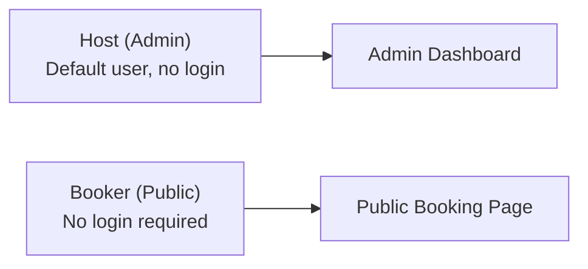
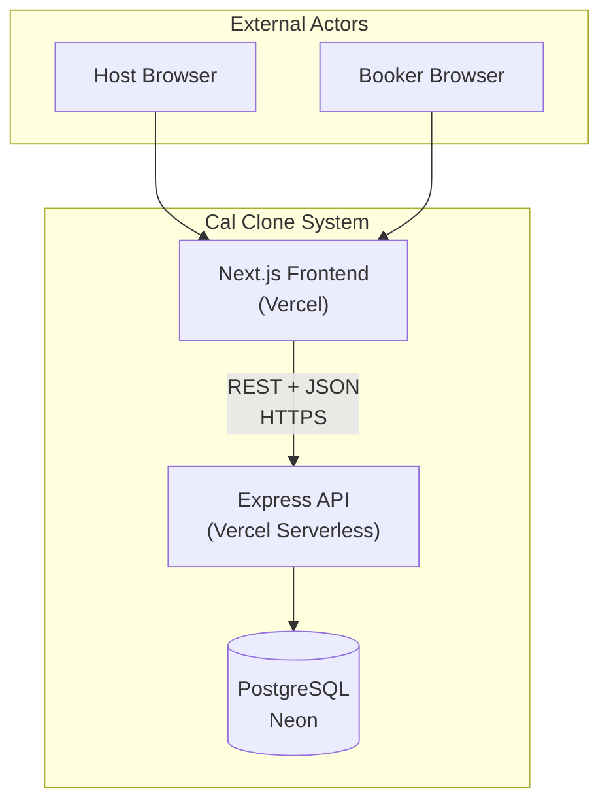
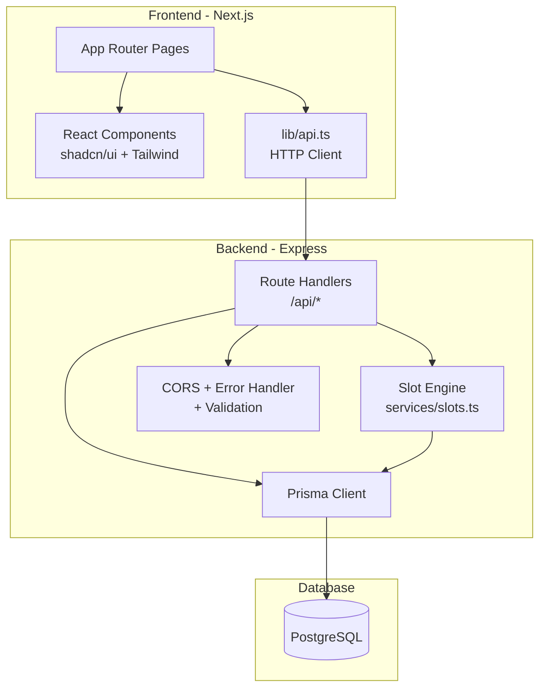
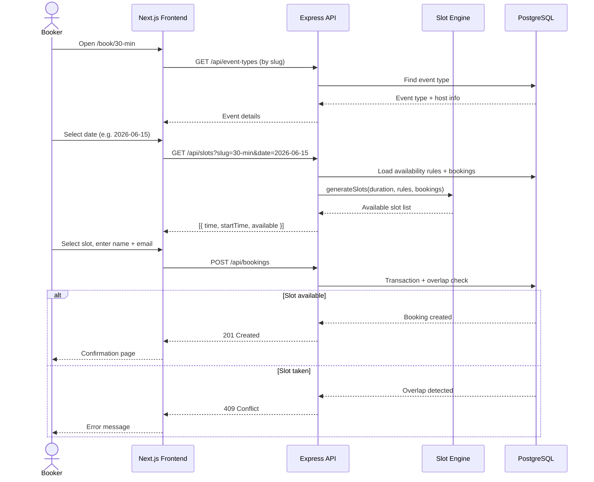
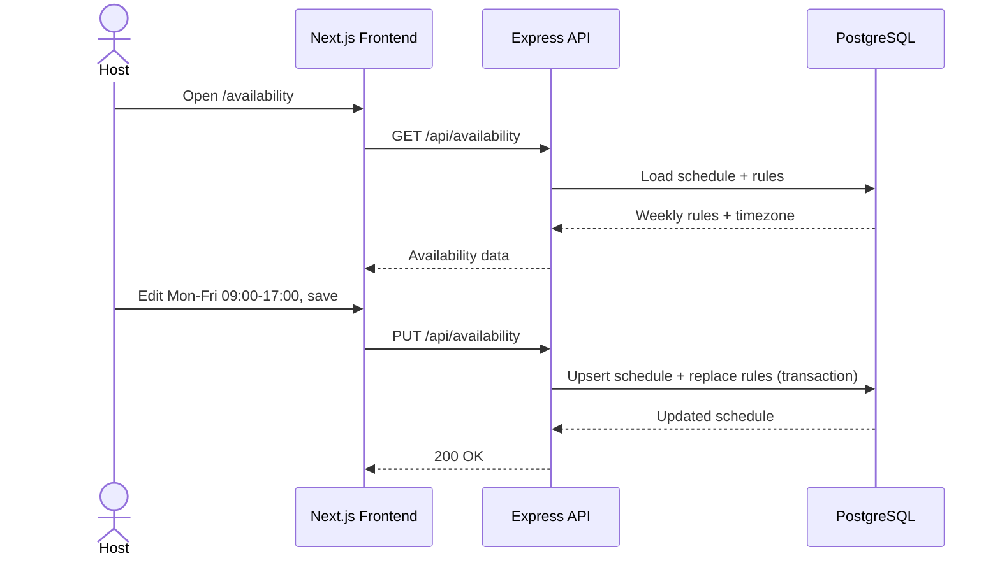
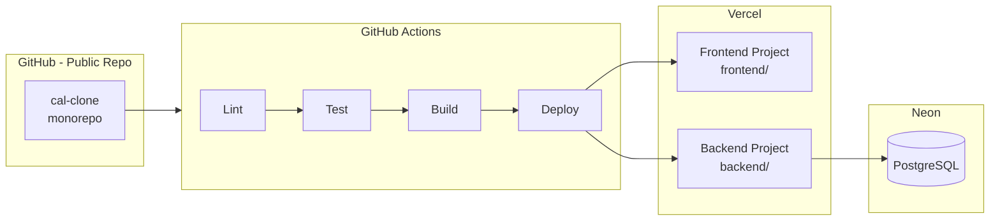
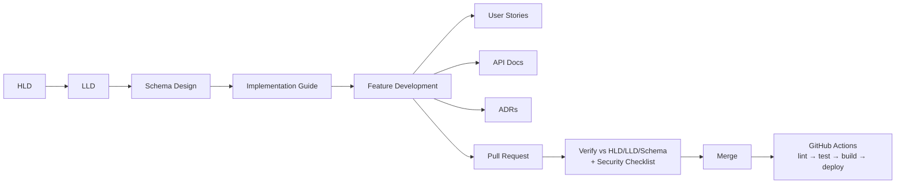

# High-Level Design (HLD)

## Cal.com Clone — Scheduling & Booking Platform

| Field | Value |
| ----- | ----- |
| **Version** | 1.0 |
| **Date** | 2026-06-12 |
| **Status** | Approved for implementation |
| **Repository** | Public GitHub (`codedbygo/cal-clone`) |

---

## 1. Purpose

This document describes the high-level architecture for a scheduling/booking web application that replicates Cal.com's core user experience. The system allows a host (default user, no login) to manage event types and availability, and allows external bookers to reserve time slots via a public booking page.

This HLD is the source of truth for architectural decisions. All implementation must align with this document, the LLD, and the Schema Design before merge.

---

## 2. Goals & Scope

### 2.1 Goals

| ID | Goal |
| -- | ---- |
| G1 | Host can create, edit, delete, and list event types with unique public booking URLs |
| G2 | Host can configure weekly availability (days, time ranges, timezone) |
| G3 | Bookers can select a date, view available slots, and complete a booking |
| G4 | System prevents double-booking of the same time slot |
| G5 | Host can view upcoming/past bookings and cancel upcoming ones |
| G6 | UI closely resembles Cal.com layout patterns and interaction design |
| G7 | Application is deployable with sample seed data for demo/evaluation |

### 2.2 In Scope (Must Have)

- Event types management (CRUD)
- Availability settings (weekly schedule + timezone)
- Public booking page (calendar, slots, form, confirmation)
- Bookings dashboard (upcoming, past, cancel)
- PostgreSQL database with Prisma ORM
- Next.js frontend + Express (Node.js) backend
- Seed data
- Public GitHub repo + deployed URLs

### 2.3 Out of Scope (v1)

| Item | Reason |
| ---- | ------ |
| User authentication / multi-tenant hosts | Assignment assumes default logged-in user |
| Email notifications | Bonus feature; time-boxed |
| Multiple availability schedules | Bonus feature |
| Date overrides | Bonus feature |
| Rescheduling flow | Bonus feature |
| Payment integration | Not in assignment |
| Calendar sync (Google/Outlook) | Not in assignment |

---

## 3. Users & Personas



| Persona | Description | Access |
| ------- | ----------- | ------ |
| **Host** | Manages event types, availability, and bookings | Admin routes: `/event-types`, `/availability`, `/bookings` |
| **Booker** | External person booking a meeting | Public route: `/book/[slug]` |

---

## 4. System Context



The system is a **decoupled two-tier web application**:

- **Presentation tier:** Next.js (React) handles routing, UI, and client-side state
- **Application tier:** Express handles business logic, validation, and data access
- **Data tier:** PostgreSQL stores persistent state

---

## 5. Architecture Overview

### 5.1 Architectural Style

| Pattern | Application |
| ------- | ----------- |
| **Monorepo** | `frontend/` and `backend/` in one GitHub repository |
| **Client-Server** | Frontend consumes REST API; no direct DB access from browser |
| **Layered backend** | Routes → Services → Prisma (data access) |
| **Stateless API** | No server-side sessions; each request is independent |

### 5.2 Component Diagram



### 5.3 Core Components

| Component | Responsibility | Technology |
| --------- | -------------- | ---------- |
| **Admin UI** | Event types, availability, bookings management | Next.js pages + React |
| **Public Booking UI** | 3-column booking flow (info, calendar, slots) | Next.js pages + React |
| **API Client** | Typed fetch wrapper to backend | `frontend/src/lib/api.ts` |
| **REST API** | HTTP endpoints, request validation, responses | Express routers |
| **Slot Engine** | Generate available time slots; pure business logic | `backend/src/services/slots.ts` |
| **Data Access** | CRUD, transactions, migrations | Prisma ORM |
| **Database** | Persistent storage | PostgreSQL (Neon) |

---

## 6. Key Data Flows

### 6.1 Public Booking Flow (Critical Path)



### 6.2 Admin — Set Availability Flow



---

## 7. Technology Stack

| Layer | Technology | Rationale |
| ----- | ---------- | --------- |
| Frontend framework | Next.js 14 (App Router) | File-based routing, Vercel-native, React SPA experience |
| Frontend language | TypeScript | Type safety, interview readiness |
| UI styling | Tailwind CSS + shadcn/ui | Rapid Cal.com-like UI |
| Backend framework | Express.js (Node.js) | Assignment requirement; REST API standard |
| Backend language | TypeScript | Shared types mindset, Prisma integration |
| ORM | Prisma | Migrations, seeding, type-safe queries |
| Database | PostgreSQL | Relational integrity, timezone support, constraints |
| Date handling | date-fns + date-fns-tz | Slot generation, timezone conversion |
| DB hosting | Neon (serverless Postgres) | Free tier, Vercel-compatible pooled connections |
| Frontend deploy | Vercel | Zero-config Next.js |
| Backend deploy | Vercel (serverless Express) | Single platform; Node.js support |
| CI/CD | GitHub Actions | lint → test → build → deploy |
| Version control | Public GitHub | Assignment submission requirement |

---

## 8. Deployment Architecture



| Environment | Frontend URL | Backend URL | Database |
| ----------- | ------------ | ----------- | -------- |
| Local | `http://localhost:3000` | `http://localhost:4000` | Neon dev branch or local Postgres |
| Production | `https://cal-clone.vercel.app` | `https://cal-clone-api.vercel.app` | Neon production (pooled URL) |

---

## 9. API Surface (Summary)

Full API documentation will be maintained in `docs/API.md` per feature.

| Method | Endpoint | Consumer | Purpose |
| ------ | -------- | -------- | ------- |
| GET | `/api/health` | DevOps | Health check |
| GET | `/api/event-types` | Admin | List event types |
| POST | `/api/event-types` | Admin | Create event type |
| PUT | `/api/event-types/:id` | Admin | Update event type |
| DELETE | `/api/event-types/:id` | Admin | Delete event type |
| GET | `/api/availability` | Admin | Get availability schedule |
| PUT | `/api/availability` | Admin | Update availability schedule |
| GET | `/api/slots` | Public | Get available slots for date |
| GET | `/api/bookings` | Admin | List bookings (upcoming/past) |
| POST | `/api/bookings` | Public | Create booking |
| PATCH | `/api/bookings/:id` | Admin | Cancel booking |

---

## 10. Non-Functional Requirements

| Category | Requirement | Target |
| -------- | ----------- | ------ |
| **Availability** | App accessible via public URLs | 99%+ (free tier acceptable) |
| **Performance** | Slot API response | < 500ms for single-date query |
| **Scalability** | Concurrent users | Sufficient for assignment demo (low traffic) |
| **Maintainability** | Code organization | Monorepo, separated concerns, documented ADRs |
| **Portability** | Deploy targets | Vercel + Neon (cloud-agnostic data layer via Prisma) |
| **Usability** | UI similarity to Cal.com | 3-column booking, sidebar admin, card-based event types |
| **Data integrity** | No double bookings | Transaction + overlap check + optional DB constraint |

---

## 11. Security Considerations (HLD Level)

| Concern | Approach |
| ------- | -------- |
| **Authentication** | Not in v1; single default host assumed |
| **Authorization** | Admin endpoints scoped to `DEFAULT_USER_ID` from env |
| **CORS** | Backend allows only `FRONTEND_URL` origin |
| **Input validation** | Validate all POST/PUT bodies (length, email format, slug pattern) |
| **SQL injection** | Prisma parameterized queries (no raw SQL unless parameterized) |
| **XSS** | React auto-escapes; no `dangerouslySetInnerHTML` |
| **Rate limiting** | Out of scope v1; note as future improvement |
| **HTTPS** | Enforced by Vercel in production |
| **Secrets** | `DATABASE_URL`, env vars in Vercel/GitHub Secrets — never committed |

Pre-PR security checklist (OWASP-aligned) will be enforced in CI and PR review.

---

## 12. Repository Structure

```
cal-clone/                    # Public GitHub repo
├── .github/workflows/        # CI/CD pipelines
├── docs/
│   ├── HLD.md               # This document
│   ├── LLD.md               # Low-level design (next)
│   ├── SCHEMA.md            # Schema design (next)
│   ├── IMPLEMENTATION_GUIDE.md
│   ├── API.md               # Per-feature API docs
│   └── adr/                 # Architecture Decision Records
├── frontend/                 # Next.js app
├── backend/                  # Express + Prisma
├── IMPLEMENTATION_PLAN.md    # One-day execution timeline
└── README.md                 # Setup + live URLs
```

---

## 13. Document Pipeline & Development Workflow



| Phase | Documents | Status |
| ----- | --------- | ------ |
| Pre-coding | HLD | **Complete** |
| Pre-coding | LLD | Pending — see [24_HOUR_SPRINT.md](./24_HOUR_SPRINT.md) Task 0.1 |
| Pre-coding | Schema Design | Pending — Task 0.2 |
| Pre-coding | Implementation Guide | Pending — Task 0.3 |
| Execution | 24-hour sprint (task-by-task) | [24_HOUR_SPRINT.md](./24_HOUR_SPRINT.md) |
| Per feature | User Stories, API docs, ADRs | During development |
| Pre-PR | HLD/LLD/Schema alignment + OWASP check | Before every merge |
| Post-merge | CI/CD deploy | GitHub Actions |

---

## 14. Risks & Mitigations

| Risk | Impact | Mitigation |
| ---- | ------ | ---------- |
| Timezone bugs in slot engine | Wrong slots shown | Store UTC; convert with date-fns-tz; test one TZ first |
| Double booking race condition | Data integrity failure | DB transaction + overlap query before insert |
| CORS misconfiguration | Frontend cannot reach API | Configure in Block 1; test fetch early |
| Vercel serverless cold starts | Slow first request | Acceptable for demo; use Neon pooled connections |
| 1-day timeline pressure | Incomplete features | Build booking flow first (Block 2); admin second |

---

## 15. Success Criteria

- [ ] All core features functional per assignment spec
- [ ] Public GitHub repo with full source code
- [ ] Deployed frontend + backend URLs working end-to-end
- [ ] Sample seed data present
- [ ] README with setup instructions and assumptions
- [ ] Documentation set complete (HLD, LLD, Schema, API, ADRs)
- [ ] CI/CD pipeline green on main branch

---

## 16. References

- Assignment specification (SDE Fullstack — Cal.com Clone)
- [IMPLEMENTATION_PLAN.md](../IMPLEMENTATION_PLAN.md) — one-day execution timeline
- Cal.com UI reference: https://cal.com
