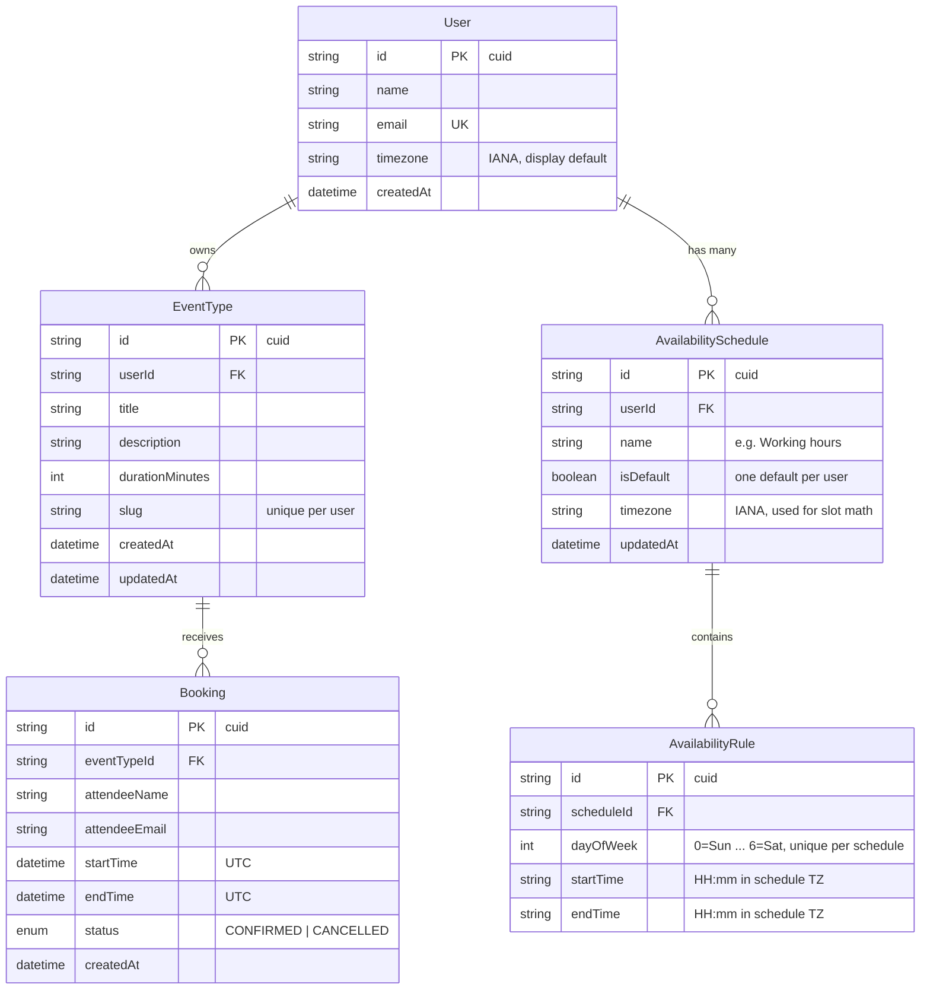

# Schema Design

## Cal.com Clone — Database Design

| Field | Value |
| ----- | ----- |
| **Version** | 1.0 |
| **Date** | 2026-06-12 |
| **Database** | PostgreSQL (Neon) |
| **ORM** | Prisma — source file: [`backend/prisma/schema.prisma`](../backend/prisma/schema.prisma) |
| **Parent docs** | [HLD.md](./HLD.md) §9 · [LLD.md](./LLD.md) §2–4 |

---

## 1. ER Diagram



---

## 2. Table-by-Table Rationale

### 2.1 `User`

One row seeded (`host@example.com`) — the assignment assumes a default logged-in host. The model still exists (rather than hardcoding) so the schema is honest about ownership and extends naturally to multi-host later.

| Column | Type | Notes |
| ------ | ---- | ----- |
| `id` | `String` cuid | PK |
| `name` | `String` | Shown on public booking page ("Host: ...") |
| `email` | `String` | **Unique** — runtime lookup key for the default user (LLD §2.3), avoids env-var coupling to a generated id |
| `timezone` | `String` | Display default; the *schedule's* timezone is authoritative for slot math |
| `createdAt` | `DateTime` | Audit |

### 2.2 `EventType`

| Column | Type | Notes |
| ------ | ---- | ----- |
| `id` | `String` cuid | PK |
| `userId` | `String` FK → User | `onDelete: Cascade` |
| `title` | `String` | 1–100 chars (validated at API, LLD §6) |
| `description` | `String` default `""` | ≤ 500 chars |
| `durationMinutes` | `Int` | Drives slot length AND slot step |
| `slug` | `String` | URL segment: `/book/[slug]` |

**Key constraint — `@@unique([userId, slug])`:** slugs are unique *per host*, not globally. Correct multi-tenant modelling (two hosts could both own `30-min`); with one seeded user it behaves as globally unique. `409 SLUG_TAKEN` maps to this constraint.

### 2.3 `AvailabilitySchedule`

| Column | Type | Notes |
| ------ | ---- | ----- |
| `id` | `String` cuid | PK |
| `userId` | `String` FK → User | `onDelete: Cascade`; multiple schedules per user (bonus) |
| `name` | `String` | Display label, e.g. "Working hours" |
| `isDefault` | `Boolean` | Exactly one schedule per user should be default; public slots use the default |
| `timezone` | `String` | **Authoritative timezone for slot generation** — rules' HH:mm values are interpreted in this zone |

Separate table (not columns on `User`) so rules have a clean parent. Multiple named schedules with a default flag is implemented as a bonus feature.

### 2.4 `AvailabilityRule`

| Column | Type | Notes |
| ------ | ---- | ----- |
| `id` | `String` cuid | PK |
| `scheduleId` | `String` FK → AvailabilitySchedule | `onDelete: Cascade` |
| `dayOfWeek` | `Int` 0–6 | 0=Sunday … 6=Saturday (JS `Date.getDay()` convention — no mapping layer needed) |
| `startTime` | `String` `"HH:mm"` | Wall-clock in schedule TZ |
| `endTime` | `String` `"HH:mm"` | Must be > `startTime` (API-validated) |

**Why `String` not `Time`/`DateTime`:** these are *recurring wall-clock* values ("every Monday 09:00 local"), not instants. Storing as TZ-aware timestamps would corrupt across DST transitions; the slot engine converts `date + HH:mm + timezone → UTC` per requested date (LLD §3.2), which handles DST correctly.

**`@@unique([scheduleId, dayOfWeek])`:** max one rule per weekday (v1 = one continuous window per day, matching the assignment "9:00 AM – 5:00 PM"). A day with no row = unavailable. PUT availability replaces all rows in a transaction (LLD §2.4).

### 2.5 `Booking`

| Column | Type | Notes |
| ------ | ---- | ----- |
| `id` | `String` cuid | PK |
| `eventTypeId` | `String` FK → EventType | `onDelete: Cascade` |
| `attendeeName` | `String` | Booker input |
| `attendeeEmail` | `String` | Booker input, not unique (same person may book repeatedly) |
| `startTime` | `DateTime` (timestamptz) | **UTC instant** |
| `endTime` | `DateTime` (timestamptz) | Computed server-side = start + duration; denormalized so the overlap query needs no join |
| `status` | `BookingStatus` enum | `CONFIRMED` (default) / `CANCELLED` — soft cancel preserves history for the "past bookings" view and frees the slot |
| `createdAt` | `DateTime` | Audit |

**Why bookings link to `EventType`, not `User`:** the host is reachable via `eventType.userId` (no duplication), and a booking is inherently *of an event type*. Cascade delete means deleting an event type removes its bookings — acceptable for v1 and documented as an assumption.

---

## 3. Indexes

| Index | Table | Serves |
| ----- | ----- | ------ |
| `@@unique([userId, slug])` | EventType | Slug lookup on public page + uniqueness |
| `@@index([userId])` | AvailabilitySchedule | List schedules per user + default lookup |
| `@@unique([scheduleId, dayOfWeek])` | AvailabilityRule | Rule fetch per weekday + uniqueness |
| `@@index([eventTypeId, startTime])` | Booking | **Hot path:** overlap check + per-date slot query |
| `@@index([startTime, status])` | Booking | Dashboard upcoming/past filters |
| `@unique(email)` | User | Default-user runtime lookup |

---

## 4. Double-Booking Prevention (schema view)

Two layers (full flow in LLD §4, decision in ADR-003):

1. **Transactional check (required):** inside `prisma.$transaction`, `findFirst` with the overlap predicate `startTime < :end AND endTime > :start AND status = CONFIRMED AND eventTypeId = :id` → insert only if empty. Served by the `[eventTypeId, startTime]` index.
2. **Exclusion constraint (optional hardening, Task 4.2):** raw migration —

```sql
CREATE EXTENSION IF NOT EXISTS btree_gist;
ALTER TABLE "Booking" ADD CONSTRAINT no_overlap_confirmed
EXCLUDE USING gist (
  "eventTypeId" WITH =,
  tstzrange("startTime", "endTime") WITH &&
) WHERE (status = 'CONFIRMED');
```

Layer 1 must fully work standalone (Neon supports `btree_gist`, but the app cannot depend on it).

---

## 5. Timezone Strategy (cross-cutting)

| Data | Stored as | Why |
| ---- | --------- | --- |
| Booking instants | UTC `timestamptz` | Comparisons and overlap math are TZ-free |
| Weekly rules | `"HH:mm"` strings + schedule `timezone` | Recurring wall-clock semantics survive DST |
| Conversion point | Slot engine, per requested date | `zonedTimeToUtc("2026-06-15T09:00", "America/New_York")` |

---

## 6. Seed Data Plan (`prisma/seed.ts`, Task 1.1)

| Entity | Rows |
| ------ | ---- |
| User | 1 — "Default Host" / `host@example.com` / `Asia/Kolkata` |
| EventType | 3 — "30 Minute Meeting" (`30-min`, 30) · "Intro Call" (`intro-call`, 15, hidden) · "15 min meeting" (`15-min`, 15) |
| AvailabilitySchedule | 1 — "Working hours", default, `Asia/Kolkata` |
| AvailabilityRule | 5 — Mon–Fri (dayOfWeek 1–5), 09:00–17:00 |
| Booking | 9 — 3 upcoming CONFIRMED · 3 past CONFIRMED · 3 past CANCELLED (`demo-*@example.com`) |

Seed is idempotent: `upsert` by email/slug so re-running never duplicates.

---

## 7. HLD §9 API → Table Traceability (gate check)

| Endpoint | Tables touched |
| -------- | -------------- |
| GET/POST/PUT/DELETE `/api/event-types` | EventType (+ User for ownership) |
| GET `/api/event-types/slug/:slug` | EventType + User (host name) |
| GET/PUT `/api/availability` | AvailabilitySchedule + AvailabilityRule |
| GET `/api/slots` | EventType + AvailabilitySchedule + AvailabilityRule + Booking |
| GET `/api/bookings` | Booking + EventType (title) |
| POST `/api/bookings` | Booking (+ EventType for duration) |
| PATCH `/api/bookings/:id` | Booking |

Every endpoint is served; no table is orphaned.
